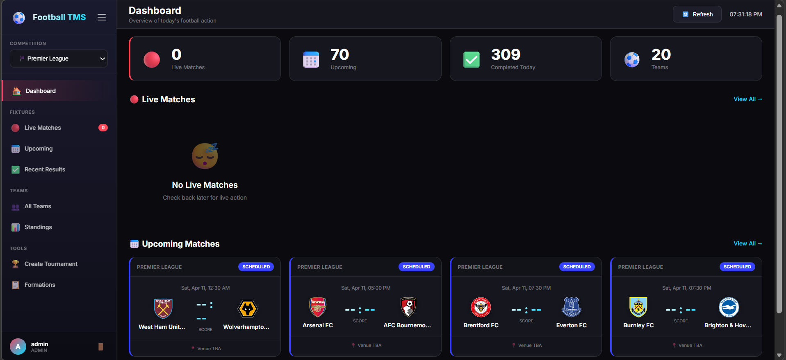
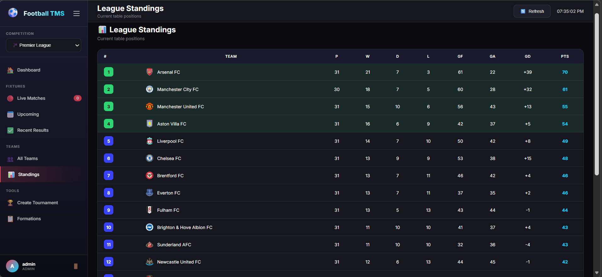
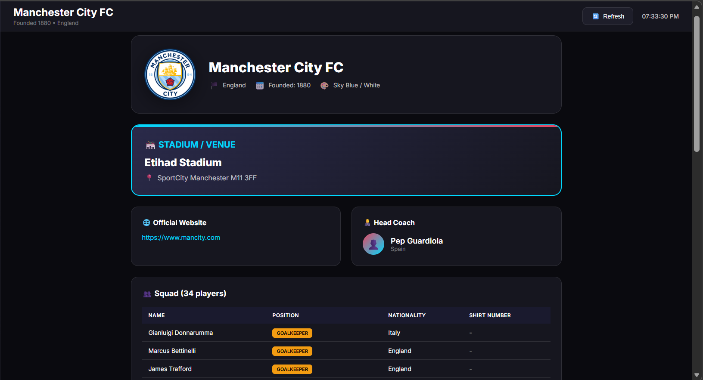
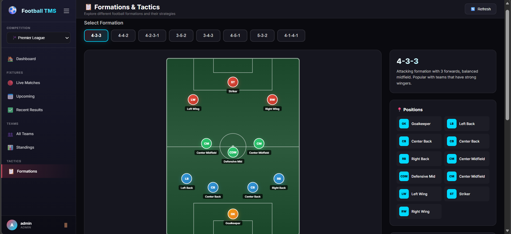
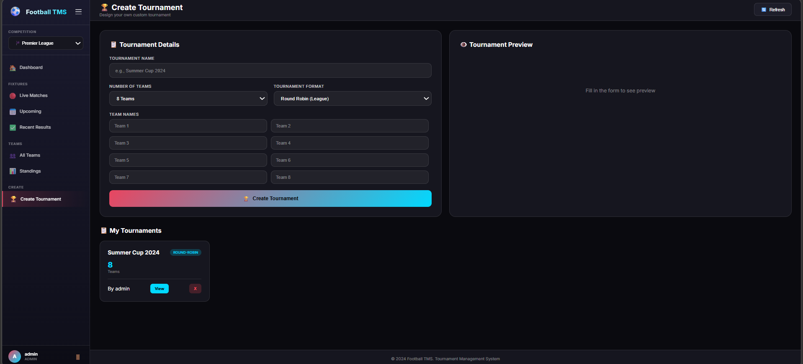

# ⚽ Football TMS

A full-stack Football Tournament Management System built with Java Servlets and Jetty, featuring live match data, league standings, team details, tactical formations, and custom tournament creation.

🔗 **Live Demo:** [football-tms.onrender.com](https://football-tms.onrender.com)

> ⚠️ Hosted on Render free tier — first load may take 30–60 seconds to spin up.

---

## 🚀 Features

- **Live Matches** — Real-time match scores and status across 12 competitions
- **Upcoming & Recent Matches** — Full fixture list with schedules and results
- **League Standings** — Live table with points, goals, and GD for all leagues
- **Team Explorer** — Browse every team with badges, squad, manager, stadium, and website
- **Formations & Tactics** — Interactive visualizer for 8 formations (4-3-3, 4-4-2, 4-2-3-1, 3-5-2, 3-4-3, 4-5-1, 5-3-2, 4-1-4-1) with position guides and tactical breakdowns
- **Custom Tournament Creator** — Create round-robin, knockout, or group stage tournaments with 4–16 teams
- **Role-based Access** — Admin, Manager, and Viewer roles with different permissions

---

## 🏆 Supported Competitions

| Competition | Region |
|---|---|
| Premier League | England |
| La Liga | Spain |
| Serie A | Italy |
| Bundesliga | Germany |
| Ligue 1 | France |
| UEFA Champions League | Europe |
| Championship | England |
| Eredivisie | Netherlands |
| Primeira Liga | Portugal |
| Brasileirão | Brazil |
| UEFA Euro Championship | Europe |
| FIFA World Cup | International |

---

## 🔐 Demo Credentials

| Role | Username | Password | Access |
|---|---|---|---|
| Admin | `admin` | `password123` | Full access — dashboard, tournaments, all features |
| Manager | `manager` | `manager123` | Formations & tactics view |
| Viewer | `viewer` | `view123` | Read-only — matches, standings, teams |

---

## 🛠️ Tech Stack

| Layer | Technology |
|---|---|
| Backend | Java Servlets |
| Server | Eclipse Jetty (embedded) |
| Database | SQLite |
| Frontend | HTML, CSS, JavaScript |
| API | Football-Data.org |
| Deployment | Docker → Render.com |

---

## 📸 Screenshots

### Dashboard


### League Standings


### Team Details


### Formations & Tactics


### Create Tournament


---

## 🏗️ Project Structure

```
FOOTBALL1/
├── src/
│   ├── MainServer.java          # Jetty server entry point
│   ├── config/
│   │   └── ApiConfig.java       # API configuration (env var)
│   ├── database/
│   │   └── DatabaseManager.java
│   └── servlet/
│       ├── LiveMatchesServlet.java
│       ├── StandingsServlet.java
│       ├── TeamsServlet.java
│       ├── TeamDetailsServlet.java
│       ├── FormationsServlet.java
│       ├── TournamentServlet.java
│       ├── LoginServlet.java
│       ├── LogoutServlet.java
│       └── SessionCheckServlet.java
├── public/                      # Static frontend files
│   ├── index.html
│   ├── login.html
│   ├── formations.html
│   └── create-tournament.html
├── lib/                         # Jetty + SQLite JARs
├── Dockerfile
└── .gitignore
```

---

## ⚙️ Running Locally

**Prerequisites:** Java 17+

```bash
# Clone the repo
git clone https://github.com/Learner12313/Football-tms1.git
cd Football-tms1

# Set your API key (Windows PowerShell)
$env:API_KEY="your-football-data-api-key"

# Compile
mkdir classes
javac -cp "lib/*" -d classes src/config/ApiConfig.java src/database/DatabaseManager.java src/servlet/*.java src/MainServer.java

# Run
java -cp "classes;lib/*" MainServer
```

Open [http://localhost:3000](http://localhost:3000)

---

## 🐳 Docker

```bash
docker build -t football-tms .
docker run -p 3000:3000 -e API_KEY=your-key football-tms
```

---

## 📡 API

Data powered by [Football-Data.org](https://www.football-data.org/) — free tier API providing live scores, standings, fixtures, and team data.

---

## 👨‍💻 Author

**Jadapola Sai Ganesh Reddy**
[GitHub](https://github.com/Learner12313)
